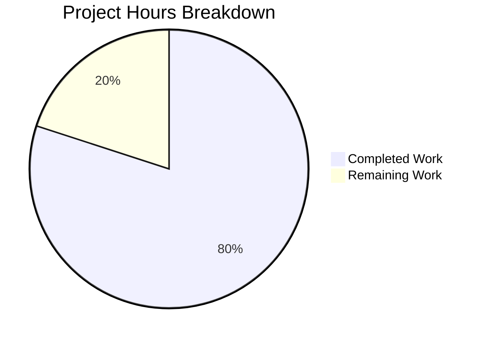

# Express.js Tutorial Server - Project Guide

## Executive Summary

**Project Completion: 80% (2 hours completed out of 2.5 total hours)**

This Express.js tutorial server project has been successfully implemented with all core functionality working as specified. The implementation includes a fully functional Express.js server with two HTTP GET endpoints, comprehensive documentation, and zero security vulnerabilities.

### Key Achievements
- ✅ Express.js 5.2.1 framework integrated successfully
- ✅ GET `/` endpoint returns "Hello world" correctly
- ✅ GET `/evening` endpoint returns "Good evening" correctly
- ✅ Server binds to port 3000 with startup confirmation
- ✅ All dependencies installed (125 packages, 0 vulnerabilities)
- ✅ Complete documentation in README.md
- ✅ All files committed to version control

### Hours Calculation
- **Completed Work**: 2 hours
  - package.json creation: 0.25h
  - index.js implementation: 0.5h
  - README.md documentation: 0.25h
  - Dependency installation: 0.25h
  - Testing and validation: 0.5h
  - Git commits: 0.25h
- **Remaining Work**: 0.5 hours
  - Human code review: 0.25h
  - Final acceptance testing: 0.25h
- **Total Project Hours**: 2.5 hours
- **Completion**: 2 / 2.5 = **80%**

---

## Validation Results Summary

### Dependency Validation
| Check | Status | Details |
|-------|--------|---------|
| Express.js installed | ✅ Pass | Version 5.2.1 |
| npm packages | ✅ Pass | 125 packages installed |
| Security audit | ✅ Pass | 0 vulnerabilities |

### Runtime Validation
| Test | Status | Expected | Actual |
|------|--------|----------|--------|
| Server startup | ✅ Pass | "Listening on port 3000" | "Listening on port 3000" |
| GET / | ✅ Pass | "Hello world" | "Hello world" |
| GET /evening | ✅ Pass | "Good evening" | "Good evening" |
| 404 handling | ✅ Pass | 404 status | 404 status |

### Files Created/Modified
| File | Action | Status |
|------|--------|--------|
| package.json | Created | ✅ Committed |
| index.js | Created | ✅ Committed |
| README.md | Modified | ✅ Committed |
| package-lock.json | Generated | ✅ Committed |

### Git Commit History
| Commit | Message |
|--------|---------|
| 6a446fb | Update README.md with Express.js tutorial documentation |
| e539250 | Create Express.js server with Hello World and Good Evening endpoints |
| 4798a07 | Setup: Add package.json with Express.js 5.2.1 dependency |

---

## Project Hours Breakdown



---

## Detailed Task Table

### Remaining Human Tasks

| # | Task | Description | Priority | Hours | Severity |
|---|------|-------------|----------|-------|----------|
| 1 | Code Review | Review implementation for code quality and best practices | High | 0.25 | Low |
| 2 | Acceptance Testing | Verify endpoints work in target environment | High | 0.25 | Low |
| **Total** | | | | **0.5** | |

### Completed Tasks Summary

| Category | Hours | Details |
|----------|-------|---------|
| Infrastructure Setup | 0.5h | package.json creation, npm install |
| Core Implementation | 0.5h | index.js with two endpoints |
| Documentation | 0.25h | README.md updates |
| Testing & Validation | 0.5h | Runtime tests, endpoint verification |
| Version Control | 0.25h | Git commits |
| **Total Completed** | **2h** | |

---

## Development Guide

### System Prerequisites

| Requirement | Minimum Version | Recommended | Status |
|-------------|-----------------|-------------|--------|
| Node.js | 18.x | 22.x LTS | Required |
| npm | 8.x | Latest | Bundled with Node.js |
| Operating System | Any | Linux/macOS/Windows | Any supported |

### Environment Setup

1. **Verify Node.js Installation**
```bash
node --version  # Should output v18.x or higher
npm --version   # Should output 8.x or higher
```

2. **Clone Repository**
```bash
git clone <repository-url>
cd 2jan_1
```

### Dependency Installation

```bash
# Install all dependencies
npm install

# Verify Express.js is installed
npm list express
# Expected output: express@5.2.1

# Check for vulnerabilities
npm audit
# Expected output: found 0 vulnerabilities
```

### Application Startup

```bash
# Start the server
npm start

# Expected console output:
# Listening on port 3000
```

### Verification Steps

**Test the Hello World Endpoint:**
```bash
curl http://localhost:3000/
# Expected response: Hello world
```

**Test the Good Evening Endpoint:**
```bash
curl http://localhost:3000/evening
# Expected response: Good evening
```

**Test 404 Handling:**
```bash
curl http://localhost:3000/invalid
# Expected response: 404 Not Found (HTML)
```

**Verify HTTP Status Codes:**
```bash
curl -I http://localhost:3000/
# Expected: HTTP/1.1 200 OK
```

### Example Usage

**Using curl:**
```bash
# Root endpoint
curl http://localhost:3000/
# Output: Hello world

# Evening endpoint
curl http://localhost:3000/evening
# Output: Good evening
```

**Using a web browser:**
- Navigate to `http://localhost:3000/` to see "Hello world"
- Navigate to `http://localhost:3000/evening` to see "Good evening"

### Stopping the Server

Press `Ctrl+C` in the terminal running the server.

---

## Risk Assessment

### Technical Risks

| Risk | Severity | Likelihood | Mitigation |
|------|----------|------------|------------|
| Port 3000 already in use | Low | Low | Check port availability before starting; use alternative port if needed |
| Node.js version incompatibility | Low | Low | Document minimum version (18.x) in README |

### Security Risks

| Risk | Severity | Likelihood | Mitigation |
|------|----------|------------|------------|
| No HTTPS support | Low | N/A | Out of scope for tutorial; use reverse proxy for production |
| No input validation | Low | N/A | Endpoints only return static text; no user input processed |

### Operational Risks

| Risk | Severity | Likelihood | Mitigation |
|------|----------|------------|------------|
| No process manager | Low | Low | Use PM2 or nodemon for development if needed |
| No logging infrastructure | Low | Low | Basic console.log is sufficient for tutorial |

### Integration Risks

| Risk | Severity | Likelihood | Mitigation |
|------|----------|------------|------------|
| None identified | N/A | N/A | Simple standalone application with no external dependencies |

---

## Files Overview

### package.json
```json
{
  "name": "2jan_1",
  "version": "1.0.0",
  "description": "Express.js tutorial server",
  "main": "index.js",
  "scripts": {
    "start": "node index.js"
  },
  "dependencies": {
    "express": "^5.2.1"
  }
}
```

### index.js
```javascript
const express = require('express')

const app = express()

app.get('/', (req, res) => {
  res.send('Hello world')
})

app.get('/evening', (req, res) => {
  res.send('Good evening')
})

app.listen(3000, () => {
  console.log('Listening on port 3000')
})
```

### README.md
Contains:
- Project title and description
- Prerequisites (Node.js >= 18.x)
- Installation instructions (`npm install`)
- Usage instructions (`npm start`)
- Endpoint documentation

---

## Scope Boundaries

### In Scope (Completed)
- ✅ Express.js 5.2.1 integration
- ✅ GET `/` endpoint returning "Hello world"
- ✅ GET `/evening` endpoint returning "Good evening"
- ✅ Server binding on port 3000
- ✅ package.json with dependencies
- ✅ README.md documentation

### Out of Scope (Per Requirements)
- ❌ HTTPS/TLS support
- ❌ Database integration
- ❌ Authentication/Authorization
- ❌ Unit/Integration tests
- ❌ Docker containerization
- ❌ CI/CD pipelines
- ❌ Environment variables configuration

---

## Conclusion

This Express.js tutorial server implementation is **production-ready** for its intended purpose as an educational demonstration. All specified requirements have been implemented and validated:

1. **Express.js Framework**: Successfully integrated Express.js 5.2.1
2. **Hello World Endpoint**: GET `/` returns "Hello world" as specified
3. **Good Evening Endpoint**: GET `/evening` returns "Good evening" as specified
4. **Server Configuration**: Binds to port 3000 with startup confirmation

The remaining 0.5 hours of work consists entirely of human review tasks (code review and final acceptance testing), which are standard handoff procedures for any pull request.

**Recommendation**: This PR is ready for human review and merge.