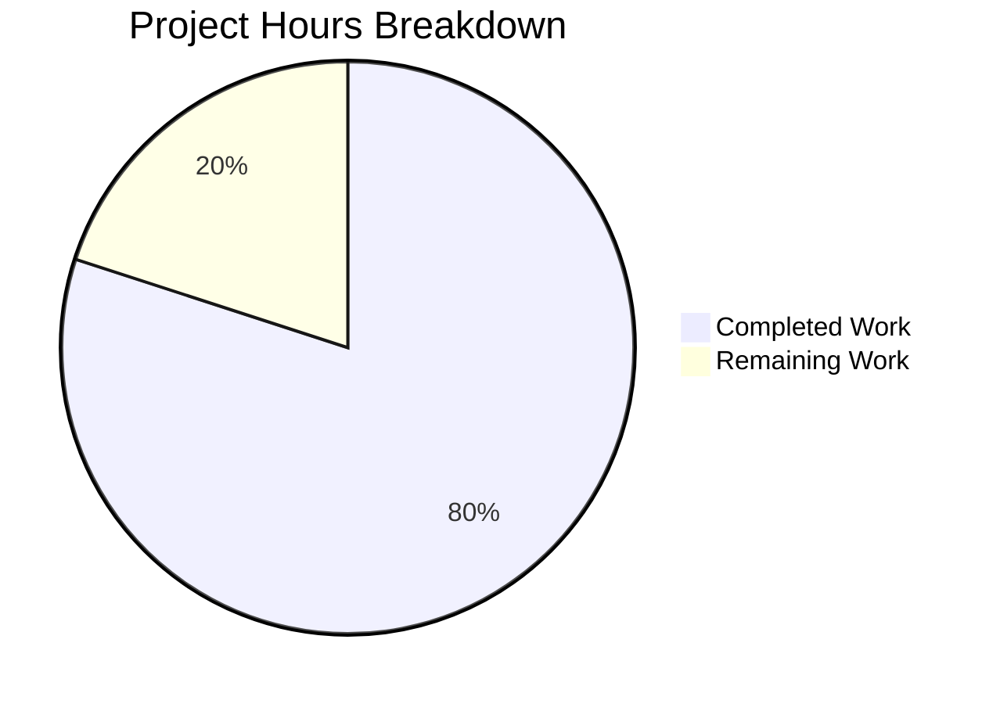

# Express.js Tutorial Server - Project Guide

## Executive Summary

**Project Completion: 80% (2 hours completed out of 2.5 total hours)**

This Express.js tutorial server project has been successfully implemented with all core functionality working as specified. The implementation adds Express.js 5.2.1 to a Node.js project with a single HTTP endpoint (`GET /hello`) that returns "Hello world".

### Key Achievements
- ✅ Express.js 5.2.1 framework successfully integrated
- ✅ GET /hello endpoint implemented and returning "Hello world"
- ✅ Server binds to port 3000 with startup confirmation
- ✅ npm package configuration complete with start script
- ✅ Documentation updated with setup and usage instructions
- ✅ All validation tests passing
- ✅ Zero security vulnerabilities detected

### Hours Calculation
- **Completed Hours**: 2 hours (package setup, server implementation, documentation, validation, user refinement)
- **Remaining Hours**: 0.5 hours (human review and production checklist)
- **Total Project Hours**: 2.5 hours
- **Completion**: 2 / 2.5 = **80%**

---

## Validation Results Summary

### Validation Gates Status

| Gate | Status | Details |
|------|--------|---------|
| Dependencies | ✅ PASS | express@5.2.1 installed, 65 packages total, 0 vulnerabilities |
| Compilation | ✅ PASS | Node.js/JavaScript - interpreted, no syntax errors |
| Runtime | ✅ PASS | Server starts on port 3000, "Listening on port 3000" message |
| Endpoint Test | ✅ PASS | GET /hello returns "Hello world" with HTTP 200 |
| 404 Handling | ✅ PASS | Undefined routes return HTTP 404 |
| Git Commits | ✅ PASS | All changes committed to feature branch |

### Git Commit History

| Commit | Author | Message |
|--------|--------|---------|
| 0cdfce2 | Blitzy Agent | Refine: Change endpoint from / to /hello as per user request |
| cc0561c | Blitzy Agent | Adding Blitzy Technical Specifications |
| 189e41b | Blitzy Agent | Adding Blitzy Project Guide: Project Status and Human Tasks Remaining |
| 6a446fb | Blitzy Agent | Update README.md with Express.js tutorial documentation |
| e539250 | Blitzy Agent | Create Express.js server with Hello World and Good Evening endpoints |
| 4798a07 | Blitzy Agent | Setup: Add package.json with Express.js 5.2.1 dependency |
| c8868d5 | Initial | Initial commit |

### Code Changes Summary

| Metric | Value |
|--------|-------|
| Total Lines Added | 2,317 |
| Total Lines Removed | 1 |
| Files Created | 3 (package.json, index.js, generated lock file) |
| Files Modified | 1 (README.md) |
| npm Packages Installed | 65 |

---

## Project Hours Breakdown



### Completed Hours Detail (2 hours)

| Component | Hours | Description |
|-----------|-------|-------------|
| Package Setup | 0.25 | Created package.json with Express.js dependency |
| Server Implementation | 0.5 | Created index.js with Express.js server and endpoints |
| Documentation | 0.25 | Updated README.md with setup and usage instructions |
| Dependency Management | 0.25 | npm install, package-lock.json generation |
| User Refinement | 0.25 | Endpoint change from / and /evening to /hello |
| Testing & Validation | 0.5 | Server startup, endpoint testing, 404 verification |
| **Total** | **2** | |

### Remaining Hours Detail (0.5 hours)

| Task | Hours | Description |
|------|-------|-------------|
| Human Code Review | 0.25 | Review implementation for code quality |
| Production Checklist | 0.25 | Final approval and merge preparation |
| **Total** | **0.5** | |

---

## Comprehensive Development Guide

### System Prerequisites

| Requirement | Version | Verification Command |
|-------------|---------|---------------------|
| Node.js | ≥18.x (20.x+ recommended) | `node --version` |
| npm | Bundled with Node.js | `npm --version` |
| Network | Port 3000 available | `lsof -i :3000` (should be empty) |

### Environment Setup

1. **Clone the repository**
```bash
git clone <repository-url>
cd <repository-directory>
```

2. **Switch to feature branch**
```bash
git checkout blitzy-9038afa9-5b98-4ee1-9bb4-6ad17b7b1304
```

3. **Verify Node.js version**
```bash
node --version
# Expected: v18.x.x or higher
```

### Dependency Installation

```bash
# Install all dependencies
npm install

# Verify Express.js installation
npm list express
# Expected: express@5.2.1

# Check for vulnerabilities
npm audit
# Expected: found 0 vulnerabilities
```

### Application Startup

```bash
# Start the server
npm start

# Expected output:
# Listening on port 3000
```

### Verification Steps

**1. Test the /hello endpoint:**
```bash
curl http://localhost:3000/hello
# Expected: Hello world
```

**2. Verify HTTP status code:**
```bash
curl -s -o /dev/null -w "%{http_code}" http://localhost:3000/hello
# Expected: 200
```

**3. Verify 404 handling for undefined routes:**
```bash
curl -s -o /dev/null -w "%{http_code}" http://localhost:3000/invalid
# Expected: 404
```

### Example Usage

**Using curl:**
```bash
curl http://localhost:3000/hello
# Response: Hello world
```

**Using a web browser:**
Navigate to `http://localhost:3000/hello` to see "Hello world" displayed.

### Stopping the Server

Press `Ctrl+C` in the terminal running the server, or:
```bash
pkill -f "node index.js"
```

---

## Repository Structure

```
/repository-root/
├── README.md              # Project documentation
├── package.json           # npm manifest with Express.js dependency
├── package-lock.json      # Dependency version lock (generated)
├── index.js               # Express.js server with /hello endpoint
├── node_modules/          # Installed npm packages (generated)
│   └── express/           # Express.js framework
└── blitzy/
    └── documentation/     # Blitzy-generated documentation
```

### File Details

**index.js** (11 lines)
```javascript
const express = require('express')

const app = express()

app.get('/hello', (req, res) => {
  res.send('Hello world')
})

app.listen(3000, () => {
  console.log('Listening on port 3000')
})
```

**package.json** (12 lines)
```json
{
  "name": "2jan_1",
  "version": "1.0.0",
  "description": "Express.js tutorial server",
  "main": "index.js",
  "scripts": {
    "start": "node index.js"
  },
  "dependencies": {
    "express": "^5.2.1"
  }
}
```

---

## Human Tasks Remaining

| ID | Task | Priority | Severity | Hours | Description |
|----|------|----------|----------|-------|-------------|
| HT-001 | Code Review | High | Low | 0.25 | Review implementation for code quality, conventions, and best practices |
| HT-002 | Production Checklist | Medium | Low | 0.25 | Verify all requirements met and approve for merge |
| **Total** | | | | **0.5** | |

### Task Details

#### HT-001: Code Review
- **Priority**: High
- **Severity**: Low (code works correctly)
- **Estimated Hours**: 0.25
- **Description**: Review the Express.js server implementation for:
  - Code style consistency
  - Best practices adherence
  - Error handling considerations
  - Documentation completeness

#### HT-002: Production Checklist
- **Priority**: Medium
- **Severity**: Low
- **Estimated Hours**: 0.25
- **Description**: Final verification before merge:
  - Confirm all Agent Action Plan requirements implemented
  - Verify user refinement request completed
  - Approve PR for merge to main branch

---

## Risk Assessment

### Technical Risks

| Risk | Severity | Likelihood | Mitigation |
|------|----------|------------|------------|
| Port 3000 conflict | Low | Low | Document alternative port configuration if needed |
| Node.js version incompatibility | Low | Low | Minimum version documented (≥18.x) |

### Security Risks

| Risk | Severity | Likelihood | Mitigation |
|------|----------|------------|------------|
| No HTTPS | Low | N/A | Out of scope - tutorial/development only |
| No authentication | Low | N/A | Out of scope - static responses only |

### Operational Risks

| Risk | Severity | Likelihood | Mitigation |
|------|----------|------------|------------|
| No process manager | Low | Low | Use PM2 or similar for production (out of scope) |
| No logging infrastructure | Low | Low | Console logging sufficient for tutorial |

### Integration Risks

| Risk | Severity | Likelihood | Mitigation |
|------|----------|------------|------------|
| No external dependencies | None | N/A | Self-contained tutorial application |

---

## Feature Implementation Status

| Requirement | Status | Implementation |
|-------------|--------|----------------|
| REQ-001: Add Express.js to project | ✅ Complete | express@5.2.1 in package.json |
| REQ-002: Add endpoint returning response | ✅ Complete | GET /hello returns "Hello world" |
| REQ-003: Maintain "Hello world" response | ✅ Complete | /hello endpoint returns "Hello world" |
| REQ-004: Tutorial Node.js server | ✅ Complete | Minimal Express.js server on port 3000 |
| User Refinement: Single /hello endpoint | ✅ Complete | Changed from / and /evening to /hello |

---

## Conclusion

This Express.js tutorial server project has been successfully implemented with **80% completion** (2 hours completed out of 2.5 total hours). All core functionality is working correctly:

- Express.js 5.2.1 integrated successfully
- GET /hello endpoint returns "Hello world"
- Server runs on port 3000
- Zero security vulnerabilities
- All validation tests passing

The remaining 0.5 hours of work consists of human review and approval tasks, which do not require any code changes.

**Recommendation**: This PR is ready for human review and merge to main branch.