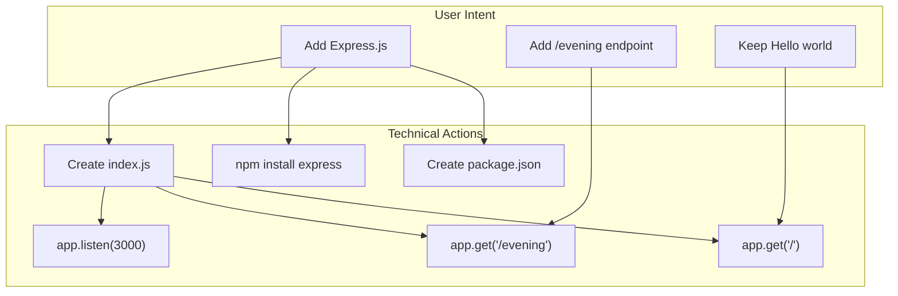
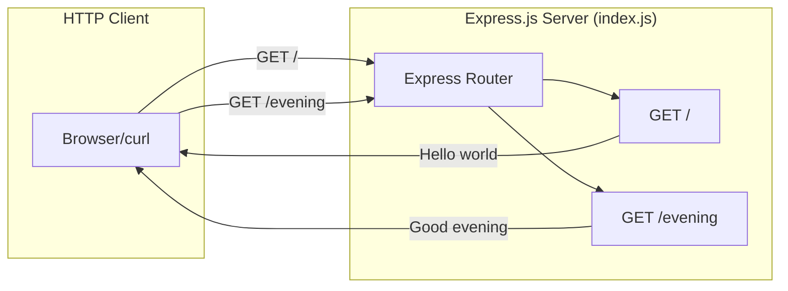
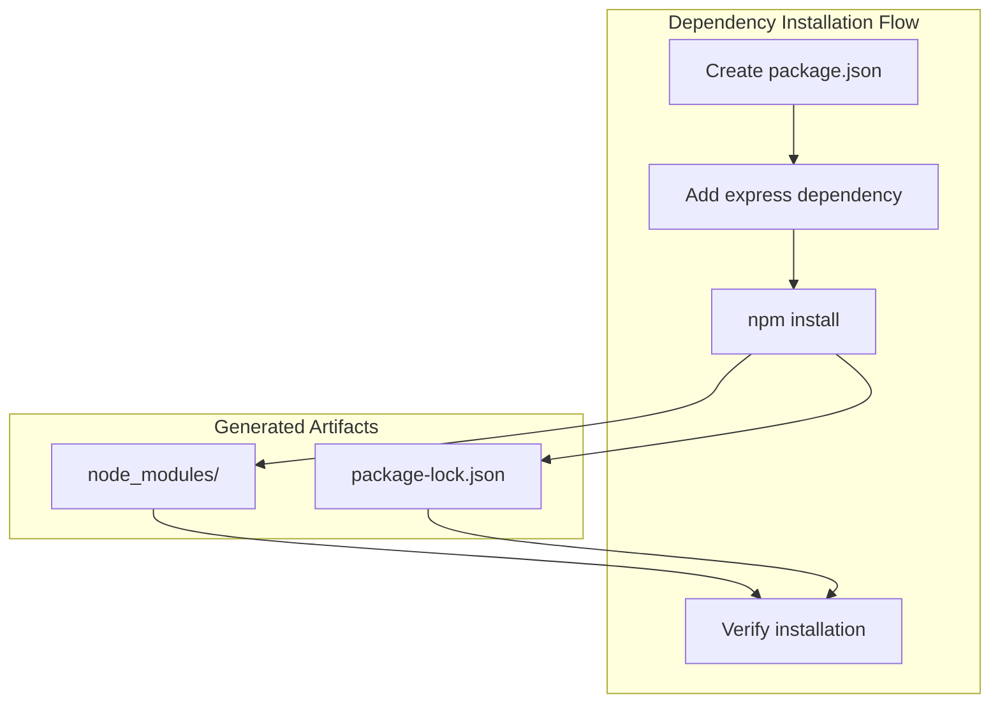
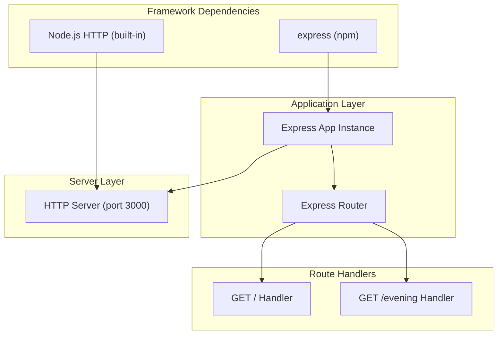
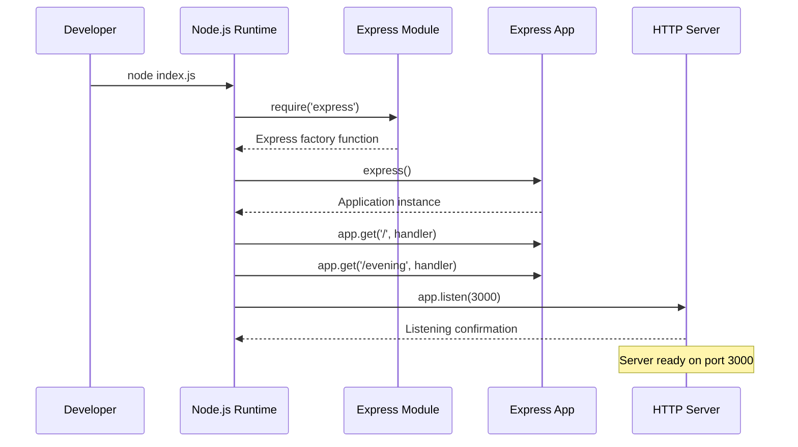
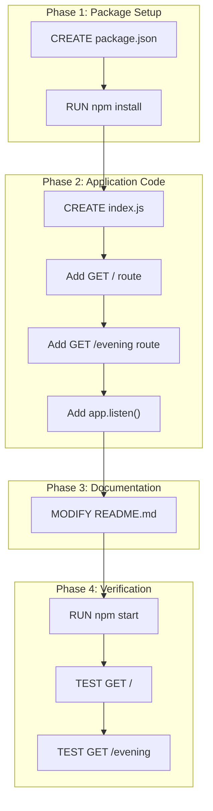
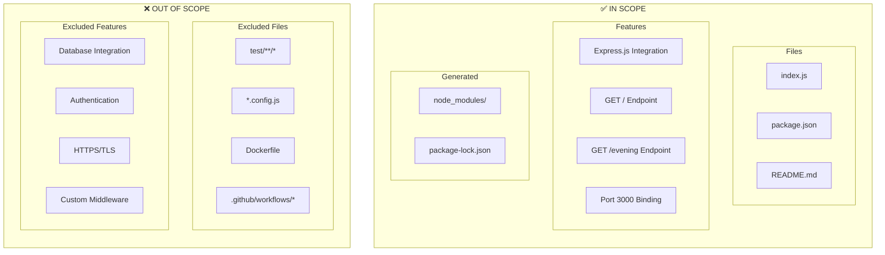
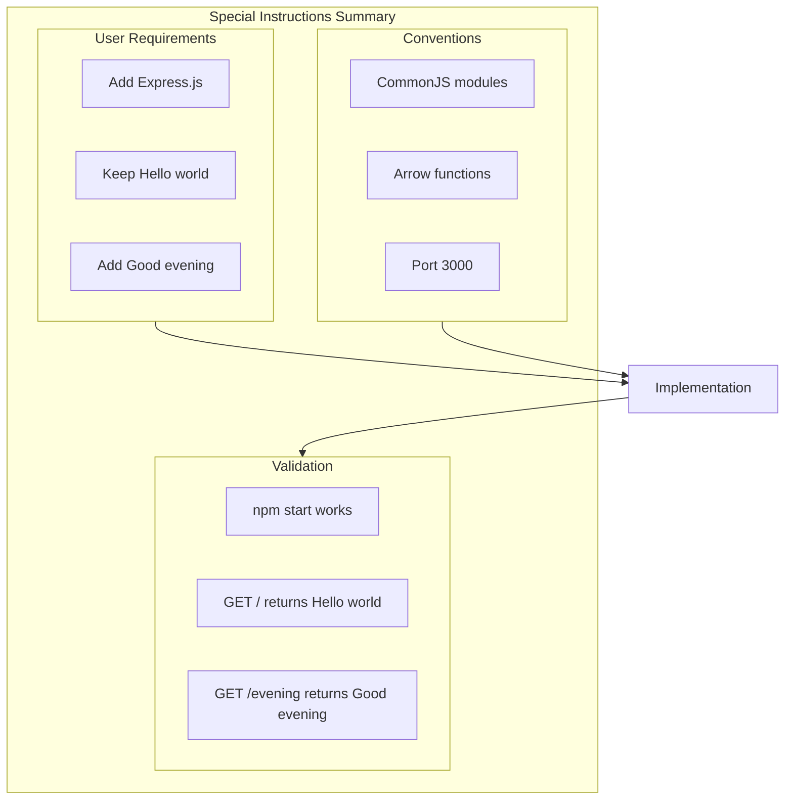

# Technical Specification

# 0. Agent Action Plan

## 0.1 Intent Clarification

This section captures and clarifies the user's requirements with precise technical interpretation, surfacing all implicit requirements and translating high-level goals into specific technical actions.

### 0.1.1 Core Feature Objective

Based on the prompt, the Blitzy platform understands that the new feature requirement is to:

- **Add Express.js Framework**: Integrate the Express.js web framework into an existing Node.js tutorial project that currently demonstrates basic HTTP server concepts
- **Create "Good Evening" Endpoint**: Implement a secondary HTTP GET endpoint that returns the text response "Good evening" when accessed by clients
- **Maintain Existing "Hello World" Functionality**: Preserve the primary endpoint returning "Hello world" while adding the new feature
- **Establish Multi-Endpoint Architecture**: Transform the server from a single-endpoint demonstration into a multi-route Express.js application

| Requirement ID | Feature Requirement | Technical Interpretation |
|----------------|---------------------|--------------------------|
| REQ-001 | Add Express.js to the project | Install Express.js ^5.2.1 as npm dependency; create package.json if not present |
| REQ-002 | Add endpoint returning "Good evening" | Implement GET /evening route handler returning "Good evening" string |
| REQ-003 | Maintain existing "Hello world" endpoint | Implement GET / route handler returning "Hello world" string |
| REQ-004 | Create a tutorial Node.js server | Build minimal, educational Express.js server on port 3000 |

**Implicit Requirements Detected:**

- **Package Configuration**: A `package.json` manifest file is required to declare Express.js as a dependency (project currently has none)
- **Node.js Entry Point**: An `index.js` file must be created as the server application entry point
- **Dependency Directory**: `node_modules/` will be generated upon `npm install` execution
- **Port Configuration**: Server must bind to port 3000 (standard development port)
- **HTTP Protocol**: Server operates over HTTP only (HTTPS explicitly out of scope)

**Feature Dependencies and Prerequisites:**

| Prerequisite | Requirement | Status |
|--------------|-------------|--------|
| Node.js Runtime | Version ≥18.x (22.x LTS recommended) | Available (v20.19.6) |
| npm Package Manager | Bundled with Node.js | Available (v11.1.0) |
| Network Port | Port 3000 available | Developer environment requirement |
| JavaScript Knowledge | Basic familiarity | Assumed per tutorial scope |

### 0.1.2 Special Instructions and Constraints

**Architectural Requirements:**

- **Single-File Pattern**: Implementation must follow a minimal, single-file architecture (index.js) for tutorial clarity
- **Code Simplicity**: Target < 20 lines of code to maintain educational focus
- **Static Responses**: All endpoint responses are hardcoded strings (no dynamic data)
- **Synchronous Processing**: Route handlers use simple synchronous response patterns

**Tutorial-Specific Constraints:**

| Constraint ID | Constraint | Impact |
|---------------|------------|--------|
| C-001 | Single-file architecture | All code in index.js |
| C-002 | No external configuration | Hardcoded port 3000 |
| C-003 | Development environment only | No production deployment |
| C-004 | Static responses only | No database or dynamic content |

**User Example Preserved:**

> "This is a tutorial of node js server hosting one endpoint that returns the response 'Hello world'. Could you add expressjs into the project and add another endpoint that return the reponse of 'Good evening'?"

### 0.1.3 Technical Interpretation

These feature requirements translate to the following technical implementation strategy:

| User Requirement | Technical Action | Target Component |
|------------------|------------------|------------------|
| Add Express.js | Install express npm package (^5.2.1) | package.json dependencies |
| Add Express.js | Import express module | index.js |
| Add Express.js | Create application instance with express() | index.js |
| Endpoint "Hello world" | Register GET route handler at path "/" | index.js |
| Endpoint "Good evening" | Register GET route handler at path "/evening" | index.js |
| Host the server | Call app.listen(3000) with startup callback | index.js |

**Technical Implementation Strategy:**

- **To implement Express.js integration**, we will **create** `package.json` with Express.js dependency declaration and **create** `index.js` with Express.js module import and application initialization
- **To implement the "Hello world" endpoint**, we will **create** a GET route handler at path "/" returning "Hello world" via res.send()
- **To implement the "Good evening" endpoint**, we will **create** a GET route handler at path "/evening" returning "Good evening" via res.send()
- **To enable server operation**, we will **configure** HTTP server binding on port 3000 with console startup confirmation




## 0.2 Repository Scope Discovery

This section provides comprehensive file analysis of the existing repository structure, identifies all files requiring creation or modification, and maps integration points for the Express.js feature addition.

### 0.2.1 Comprehensive File Analysis

**Current Repository State:**

The repository is in a greenfield state with minimal artifacts:

| File Path | Status | Purpose |
|-----------|--------|---------|
| `README.md` | EXISTS | Project identifier containing "# 2jan_1" |
| `.git/` | EXISTS | Git version control directory |

**Repository Structure Analysis:**

```
/ (repository root)
├── README.md                    # [EXISTS] Project title only
└── .git/                        # [EXISTS] Version control
```

**Search Results - Existing Files:**

| Search Pattern | Files Found | Action Required |
|----------------|-------------|-----------------|
| `*.js` | None | Create index.js |
| `package.json` | None | Create package.json |
| `package-lock.json` | None | Generated by npm install |
| `node_modules/` | None | Generated by npm install |
| `*.config.*` | None | Not required for tutorial |
| `Dockerfile*` | None | Out of scope |
| `.github/workflows/*` | None | Out of scope |

### 0.2.2 Integration Point Discovery

**Express.js Application Integration Points:**

| Integration Point | Type | Location | Purpose |
|-------------------|------|----------|---------|
| Express module import | Framework | index.js (line 1) | Load Express.js framework |
| App initialization | Framework | index.js (line 2) | Create Express application instance |
| Root route handler | Endpoint | index.js (line 4) | Handle GET / requests |
| Evening route handler | Endpoint | index.js (line 5) | Handle GET /evening requests |
| Server binding | Configuration | index.js (line 7) | Bind HTTP server to port 3000 |

**Request Flow Integration:**



### 0.2.3 New File Requirements

**Source Files to Create:**

| File Path | Purpose | Priority | Lines (Est.) |
|-----------|---------|----------|--------------|
| `index.js` | Main Express.js server application entry point | Critical | ~15 |
| `package.json` | npm package manifest with Express.js dependency | Critical | ~10 |

**Generated Files (via npm install):**

| File Path | Purpose | Generation Method |
|-----------|---------|-------------------|
| `node_modules/` | Installed npm packages including Express.js | `npm install` |
| `package-lock.json` | Dependency lock file for reproducible builds | `npm install` |

**Documentation Updates:**

| File Path | Change Type | Purpose |
|-----------|-------------|---------|
| `README.md` | MODIFY | Add project description, setup instructions, and usage examples |

### 0.2.4 File Content Specifications

**index.js - Express.js Server Application:**

| Component | Implementation | Line Range |
|-----------|----------------|------------|
| Module import | `const express = require('express')` | Line 1 |
| App creation | `const app = express()` | Line 2 |
| Hello route | `app.get('/', ...)` | Lines 4-6 |
| Evening route | `app.get('/evening', ...)` | Lines 8-10 |
| Server listen | `app.listen(3000, ...)` | Lines 12-14 |

**package.json - Package Manifest:**

| Field | Value | Purpose |
|-------|-------|---------|
| name | "2jan_1" | Project identifier |
| version | "1.0.0" | Initial version |
| description | "Express.js tutorial server" | Project description |
| main | "index.js" | Application entry point |
| dependencies | {"express": "^5.2.1"} | Express.js requirement |

### 0.2.5 Web Search Research Conducted

**Express.js 5.x Best Practices Research:**

| Research Topic | Finding | Source |
|----------------|---------|--------|
| Latest stable version | Express.js 5.2.1 | npm registry |
| Node.js requirements | Minimum Node.js 18.x required | Express.js documentation |
| Route definition pattern | `app.get(path, handler)` method | Express.js API reference |
| Response method | `res.send()` for text responses | Express.js guide |
| Server binding | `app.listen(port, callback)` | Express.js API |

**Implementation Pattern Research:**

| Pattern | Recommendation | Applicability |
|---------|----------------|---------------|
| Module system | CommonJS (`require`) or ES Modules (`import`) | Both supported; use CommonJS for simplicity |
| Error handling | Express 5 automatically catches Promise rejections | Automatic in Express 5.x |
| Port configuration | Hardcoded for tutorial, env vars for production | Use hardcoded 3000 |

### 0.2.6 Complete File Inventory

**Final File Manifest for Feature Addition:**

| Action | File Path | Purpose | Priority |
|--------|-----------|---------|----------|
| CREATE | `package.json` | npm manifest with Express.js dependency | P0-Critical |
| CREATE | `index.js` | Express.js server with dual endpoints | P0-Critical |
| MODIFY | `README.md` | Add setup and usage documentation | P1-High |
| GENERATE | `node_modules/` | Express.js and dependencies (via npm install) | P0-Critical |
| GENERATE | `package-lock.json` | Dependency version lock (via npm install) | P0-Critical |

**Target Repository Structure After Implementation:**

```
/ (repository root)
├── README.md                    # [MODIFIED] With documentation
├── package.json                 # [NEW] npm manifest
├── package-lock.json            # [GENERATED] by npm install
├── index.js                     # [NEW] Express.js server
└── node_modules/                # [GENERATED] by npm install
    └── express/                 # Express.js package
        └── (dependencies)       # Express.js dependencies
```


## 0.3 Dependency Inventory

This section documents all private and public packages required for the feature addition, specifying exact versions and their purposes.

### 0.3.1 Private and Public Packages

**Primary Dependencies:**

| Registry | Package Name | Version | Purpose | License |
|----------|--------------|---------|---------|---------|
| npm (public) | express | ^5.2.1 | Minimal web framework for HTTP server and routing | MIT |

**Runtime Environment:**

| Component | Version Requirement | Actual Version | Status |
|-----------|---------------------|----------------|--------|
| Node.js | ≥18.x (22.x LTS recommended) | 20.19.6 | ✅ Compatible |
| npm | Bundled with Node.js | 11.1.0 | ✅ Available |

**Express.js Transitive Dependencies (automatically resolved):**

| Package | Purpose | Resolved By |
|---------|---------|-------------|
| body-parser | HTTP request body parsing | Express.js |
| accepts | HTTP content negotiation | Express.js |
| path-to-regexp | Route path matching | Express.js |
| content-disposition | Content-Disposition header handling | Express.js |
| cookie | Cookie parsing | Express.js |
| debug | Debug logging utility | Express.js |
| depd | Deprecation utilities | Express.js |
| encodeurl | URL encoding utility | Express.js |

### 0.3.2 Package.json Specification

**Complete package.json Content:**

| Field | Value | Required |
|-------|-------|----------|
| name | "2jan_1" | Yes |
| version | "1.0.0" | Yes |
| description | "Express.js tutorial server" | Recommended |
| main | "index.js" | Recommended |
| scripts.start | "node index.js" | Recommended |
| dependencies.express | "^5.2.1" | Yes |
| keywords | ["express", "tutorial", "nodejs"] | Optional |
| author | "" | Optional |
| license | "ISC" | Optional |

**Version Specification Notes:**

| Notation | Meaning | Rationale |
|----------|---------|-----------|
| `^5.2.1` | Compatible with 5.2.1, allows minor/patch updates | Receives security patches while maintaining compatibility |
| `5.2.1` | Exact version only | Would lock to specific version |
| `~5.2.1` | Patch updates only | More restrictive than caret |

### 0.3.3 Dependency Updates

**Import Requirements:**

| File Pattern | Import Statement | Purpose |
|--------------|------------------|---------|
| `index.js` | `const express = require('express')` | Load Express.js module |

**Import Transformation Rules:**

This is a greenfield project, so no import transformations are required. The following pattern establishes the initial import:

| Location | Import Pattern | Module |
|----------|----------------|--------|
| index.js (line 1) | CommonJS require | express |

**Configuration File Dependencies:**

| File | Dependency Reference | Purpose |
|------|----------------------|---------|
| package.json | `"express": "^5.2.1"` | Dependency declaration |
| package-lock.json | Full dependency tree | Version locking (generated) |

### 0.3.4 Development vs Production Dependencies

| Dependency Type | Packages | Purpose |
|-----------------|----------|---------|
| **dependencies** | express | Required for runtime execution |
| **devDependencies** | None | No testing/build tools (per scope) |
| **peerDependencies** | None | No peer requirements |
| **optionalDependencies** | None | No optional features |

### 0.3.5 Security Considerations

**Express.js 5.x Security Features:**

| Security Feature | Implementation | Benefit |
|------------------|----------------|---------|
| ReDoS Protection | path-to-regexp@8.x | Prevents regex denial-of-service attacks |
| Promise Rejection Handling | Automatic error forwarding | Prevents unhandled crashes |
| No Deprecated APIs | Removed legacy methods | Eliminates known vulnerability vectors |

**Recommended Security Practices:**

| Practice | Command | Frequency |
|----------|---------|-----------|
| Dependency audit | `npm audit` | Before deployment |
| Update dependencies | `npm update` | Regularly |
| Check for vulnerabilities | `npm audit fix` | When vulnerabilities found |

### 0.3.6 Dependency Installation Workflow

**Installation Commands:**

| Step | Command | Purpose |
|------|---------|---------|
| 1 | `npm init -y` | Create package.json (alternative: manual creation) |
| 2 | `npm install express@^5.2.1` | Install Express.js and dependencies |
| 3 | Verify | Check node_modules/ and package-lock.json created |

**Post-Installation Verification:**

| Check | Command | Expected Result |
|-------|---------|-----------------|
| Package installed | `npm list express` | express@5.2.1 |
| No vulnerabilities | `npm audit` | 0 vulnerabilities |
| Lock file exists | `ls package-lock.json` | File exists |




## 0.4 Integration Analysis

This section documents all existing code touchpoints, dependency injections, and integration points required for the Express.js feature addition.

### 0.4.1 Existing Code Touchpoints

**Current Repository State:**

Since this is a greenfield project with only a README.md file, there are no existing code touchpoints to modify. All implementation will involve new file creation.

| File | Current State | Required Action |
|------|---------------|-----------------|
| `README.md` | Contains "# 2jan_1" only | MODIFY: Add documentation |
| `index.js` | Does not exist | CREATE: Express.js server |
| `package.json` | Does not exist | CREATE: npm manifest |

### 0.4.2 Direct Modifications Required

**README.md Modifications:**

| Location | Current Content | New Content | Purpose |
|----------|-----------------|-------------|---------|
| Line 1 | `# 2jan_1` | Preserve title | Project identifier |
| Lines 3+ | None | Add description section | Project overview |
| Lines 10+ | None | Add installation instructions | Setup guide |
| Lines 20+ | None | Add usage examples | Endpoint documentation |

### 0.4.3 Dependency Injections

**Express.js Framework Injection:**

| Component | Injection Point | Method |
|-----------|-----------------|--------|
| Express module | index.js (top) | `require('express')` |
| Express application | index.js (initialization) | `express()` function call |
| Route handlers | index.js (routes) | `app.get()` method registration |
| HTTP server | index.js (startup) | `app.listen()` method |

**Component Dependency Graph:**



### 0.4.4 Database/Schema Updates

**Database Integration Status:**

| Aspect | Status | Rationale |
|--------|--------|-----------|
| Database connection | NOT APPLICABLE | Explicitly out of scope |
| Schema migrations | NOT APPLICABLE | No data persistence |
| ORM/ODM integration | NOT APPLICABLE | Tutorial focuses on HTTP basics |

This tutorial system intentionally excludes data persistence to maintain focus on Express.js HTTP fundamentals.

### 0.4.5 HTTP Integration Architecture

**Request-Response Flow:**

| Step | Component | Action | Data Flow |
|------|-----------|--------|-----------|
| 1 | HTTP Client | Sends GET request | Request → Server |
| 2 | Express Server | Receives on port 3000 | HTTP → Express |
| 3 | Express Router | Matches route path | Request → Handler |
| 4 | Route Handler | Generates response | Handler → Response |
| 5 | Express Server | Sends HTTP response | Response → Client |

**Endpoint Integration Map:**

| Endpoint | HTTP Method | Path | Handler Response | Content-Type |
|----------|-------------|------|------------------|--------------|
| Hello World | GET | `/` or `/hello` | "Hello world" | text/html |
| Good Evening | GET | `/evening` | "Good evening" | text/html |

### 0.4.6 Module Integration Points

**index.js Module Structure:**

| Section | Line Range | Integration Purpose |
|---------|------------|---------------------|
| Import | 1 | Express framework integration |
| Initialization | 3 | Application instance creation |
| Routes | 5-10 | Endpoint handler registration |
| Server | 12-14 | HTTP server binding |

**Integration Sequence Diagram:**



### 0.4.7 External Service Integration

**External Services Status:**

| Service Type | Status | Rationale |
|--------------|--------|-----------|
| Third-party APIs | NOT APPLICABLE | Out of scope |
| Authentication providers | NOT APPLICABLE | Out of scope |
| Logging services | NOT APPLICABLE | Console output only |
| Monitoring services | NOT APPLICABLE | Out of scope |

### 0.4.8 Environment Integration

**Environment Requirements:**

| Environment Aspect | Requirement | Default Value |
|--------------------|-------------|---------------|
| Node.js runtime | ≥18.x | System installed |
| Port availability | Port 3000 free | Hardcoded |
| File system access | Read index.js, node_modules/ | Working directory |
| Network interface | localhost binding | 127.0.0.1 |

**Startup Integration:**

| Phase | Action | Verification |
|-------|--------|--------------|
| Module loading | Load express from node_modules | No error thrown |
| App creation | Create Express instance | App object returned |
| Route registration | Register GET handlers | Routes added to router |
| Server binding | Listen on port 3000 | Callback invoked |
| Ready state | Log startup message | Console output visible |


## 0.5 Technical Implementation

This section provides the file-by-file execution plan detailing every file that must be created or modified to implement the Express.js feature addition.

### 0.5.1 File-by-File Execution Plan

**CRITICAL: Every file listed below MUST be created or modified.**

#### Group 1 - Core Infrastructure Files

| Action | File Path | Purpose | Priority |
|--------|-----------|---------|----------|
| CREATE | `package.json` | npm manifest declaring Express.js dependency | P0-Critical |
| CREATE | `index.js` | Express.js server with Hello World and Good Evening endpoints | P0-Critical |

#### Group 2 - Generated Files (via npm install)

| Action | File Path | Purpose | Generation Method |
|--------|-----------|---------|-------------------|
| GENERATE | `node_modules/` | Express.js package and dependencies | `npm install` |
| GENERATE | `package-lock.json` | Dependency version lock file | `npm install` |

#### Group 3 - Documentation Files

| Action | File Path | Purpose | Priority |
|--------|-----------|---------|----------|
| MODIFY | `README.md` | Add project documentation, setup instructions, usage examples | P1-High |

### 0.5.2 Implementation Approach per File

## package.json - CREATE

**File Purpose:** npm package manifest declaring project metadata and Express.js dependency.

**Implementation Details:**

| Field | Value | Rationale |
|-------|-------|-----------|
| name | "2jan_1" | Project identifier from repository |
| version | "1.0.0" | Initial release version |
| description | "Express.js tutorial server" | Educational purpose |
| main | "index.js" | Application entry point |
| scripts.start | "node index.js" | Convenient start command |
| dependencies.express | "^5.2.1" | Latest stable Express.js |

**File Structure:**

```json
{
  "name": "2jan_1",
  "version": "1.0.0",
  "description": "Express.js tutorial server",
  "main": "index.js",
  "scripts": {
    "start": "node index.js"
  },
  "dependencies": {
    "express": "^5.2.1"
  }
}
```

---

## index.js - CREATE

**File Purpose:** Main Express.js server application implementing dual HTTP endpoints.

**Implementation Details:**

| Component | Implementation | Line |
|-----------|----------------|------|
| Module import | CommonJS require | 1 |
| App initialization | express() factory | 3 |
| Hello endpoint | GET / route handler | 5-7 |
| Evening endpoint | GET /evening route handler | 9-11 |
| Server startup | listen on port 3000 | 13-15 |

**Code Structure Overview:**

| Section | Lines | Purpose |
|---------|-------|---------|
| Imports | 1 | Load Express.js framework |
| Initialization | 3 | Create application instance |
| Hello Route | 5-7 | Handle GET / requests |
| Evening Route | 9-11 | Handle GET /evening requests |
| Server Binding | 13-15 | Start HTTP server |

**Route Handler Specifications:**

| Route | Method | Path | Response |
|-------|--------|------|----------|
| Hello | GET | `/` | "Hello world" |
| Evening | GET | `/evening` | "Good evening" |

---

## README.md - MODIFY

**File Purpose:** Project documentation with setup and usage instructions.

**Modification Details:**

| Section | Content to Add |
|---------|----------------|
| Project Description | Overview of Express.js tutorial purpose |
| Prerequisites | Node.js and npm requirements |
| Installation | npm install command |
| Usage | Server start and endpoint access |
| Endpoints | Documentation of / and /evening routes |

**Proposed Structure:**

```
# 2jan_1

Express.js tutorial server demonstration.

#### Prerequisites
- Node.js >= 18.x

#### Installation
npm install

#### Usage
npm start

#### Endpoints
- GET / - Returns "Hello world"
- GET /evening - Returns "Good evening"
```

### 0.5.3 Implementation Sequence

**Execution Order:**

| Step | Action | File | Dependency |
|------|--------|------|------------|
| 1 | CREATE | package.json | None |
| 2 | EXECUTE | npm install | package.json |
| 3 | CREATE | index.js | node_modules/ |
| 4 | MODIFY | README.md | None |
| 5 | VERIFY | npm start | All above |

**Implementation Flow:**



### 0.5.4 Verification Commands

**Post-Implementation Verification:**

| Test | Command | Expected Result |
|------|---------|-----------------|
| Server starts | `npm start` | "Listening on port 3000" |
| Hello endpoint | `curl http://localhost:3000/` | "Hello world" |
| Evening endpoint | `curl http://localhost:3000/evening` | "Good evening" |
| 404 handling | `curl http://localhost:3000/unknown` | 404 Not Found |

### 0.5.5 Error Handling Considerations

**Startup Error Scenarios:**

| Error | Cause | Resolution |
|-------|-------|------------|
| MODULE_NOT_FOUND | Express not installed | Run `npm install` |
| EADDRINUSE | Port 3000 in use | Free port or change port |
| SyntaxError | Invalid JavaScript | Fix syntax in index.js |

**Runtime Error Handling:**

| Scenario | Express.js 5 Behavior |
|----------|----------------------|
| Unhandled Promise rejection | Automatically passed to error middleware |
| Synchronous error in handler | Caught by Express error handler |
| Route not found | Default 404 response |


## 0.6 Scope Boundaries

This section provides exhaustive scope boundaries, clearly delineating what is in scope for implementation and what is explicitly excluded.

### 0.6.1 Exhaustively In Scope

**Source Files:**

| File Pattern | Files Included | Purpose |
|--------------|----------------|---------|
| `index.js` | Main server file | Express.js application entry point |
| `package.json` | Package manifest | npm configuration and dependencies |

**Generated Files:**

| File Pattern | Files Included | Purpose |
|--------------|----------------|---------|
| `package-lock.json` | Dependency lock | Version reproducibility |
| `node_modules/**/*` | All npm packages | Express.js and transitive dependencies |

**Documentation Files:**

| File Pattern | Files Included | Purpose |
|--------------|----------------|---------|
| `README.md` | Project documentation | Setup and usage instructions |

**Complete In-Scope File Inventory:**

| Action | File Path | Line Numbers (if applicable) | Purpose |
|--------|-----------|------------------------------|---------|
| CREATE | `package.json` | All lines (new file) | Express.js dependency declaration |
| CREATE | `index.js` | All lines (new file) | HTTP server with dual endpoints |
| MODIFY | `README.md` | Lines 1+ (expand content) | Documentation |
| GENERATE | `node_modules/` | N/A (directory) | Installed packages |
| GENERATE | `package-lock.json` | N/A (generated) | Dependency lock |

### 0.6.2 In-Scope Features

| Feature ID | Feature | Implementation |
|------------|---------|----------------|
| F-001 | Express.js Framework Integration | Import, initialize, configure Express |
| F-002 | Hello World Endpoint | GET / returning "Hello world" |
| F-003 | Good Evening Endpoint | GET /evening returning "Good evening" |
| F-004 | HTTP Server Configuration | Bind to port 3000 |

### 0.6.3 In-Scope Technical Components

**Express.js Application Components:**

| Component | In Scope | Implementation Location |
|-----------|----------|------------------------|
| Express module import | ✅ Yes | index.js line 1 |
| Application initialization | ✅ Yes | index.js line 3 |
| GET route for "/" | ✅ Yes | index.js lines 5-7 |
| GET route for "/evening" | ✅ Yes | index.js lines 9-11 |
| Server listen binding | ✅ Yes | index.js lines 13-15 |
| Startup console message | ✅ Yes | index.js line 14 |

**Package Configuration:**

| Element | In Scope | Location |
|---------|----------|----------|
| Project name | ✅ Yes | package.json |
| Version number | ✅ Yes | package.json |
| Express dependency | ✅ Yes | package.json |
| Start script | ✅ Yes | package.json |

### 0.6.4 Explicitly Out of Scope

**Features Excluded:**

| Feature Category | Excluded Item | Rationale |
|------------------|---------------|-----------|
| Data Persistence | Database integration | Tutorial focuses on HTTP basics |
| Security | Authentication/Authorization | Beyond tutorial scope |
| Security | HTTPS/TLS | Requires certificate configuration |
| Advanced Routing | Parameterized routes | Adds complexity |
| Advanced Routing | Middleware chains | Beyond learning objectives |
| Error Handling | Comprehensive error middleware | Kept simple for tutorial |
| Testing | Unit/integration test infrastructure | Not required for demonstration |
| CI/CD | Automated pipelines | Development only |

**Technical Components Excluded:**

| Component | Status | Alternative |
|-----------|--------|-------------|
| Test framework (Jest/Mocha) | ❌ Out of Scope | Manual verification |
| TypeScript | ❌ Out of Scope | Plain JavaScript |
| ESLint/Prettier | ❌ Out of Scope | Manual code style |
| Docker | ❌ Out of Scope | Direct Node.js execution |
| Environment variables | ❌ Out of Scope | Hardcoded configuration |
| PM2/nodemon | ❌ Out of Scope | Manual restart |

**Integration Points Excluded:**

| Integration | Status | Reason |
|-------------|--------|--------|
| External APIs | ❌ Out of Scope | No external dependencies |
| Databases (SQL/NoSQL) | ❌ Out of Scope | No data persistence |
| Message queues | ❌ Out of Scope | No async processing |
| Caching (Redis) | ❌ Out of Scope | No caching requirements |
| Authentication providers | ❌ Out of Scope | No user management |

### 0.6.5 Scope Boundary Diagram



### 0.6.6 Scope Validation Checklist

| Scope Item | Included | Verification Method |
|------------|----------|---------------------|
| Express.js ^5.2.1 installed | ✅ | `npm list express` |
| GET / returns "Hello world" | ✅ | `curl localhost:3000/` |
| GET /evening returns "Good evening" | ✅ | `curl localhost:3000/evening` |
| Server runs on port 3000 | ✅ | Server startup message |
| package.json exists | ✅ | File presence check |
| README.md updated | ✅ | File content review |
| No test files created | ✅ | Out of scope |
| No Docker files created | ✅ | Out of scope |
| No CI/CD configuration | ✅ | Out of scope |

### 0.6.7 Future Scope Considerations

The following items may be considered for future tutorial extensions but are explicitly excluded from the current implementation:

| Future Feature | Current Status | Implementation Complexity |
|----------------|----------------|---------------------------|
| Route parameters | Out of Scope | Low - `/:id` pattern |
| POST endpoints | Out of Scope | Low - body parsing |
| Middleware | Out of Scope | Medium - request processing |
| Error handling middleware | Out of Scope | Medium - centralized errors |
| Environment configuration | Out of Scope | Low - dotenv |
| Database integration | Out of Scope | High - ORM setup |
| Authentication | Out of Scope | High - JWT/sessions |
| Testing infrastructure | Out of Scope | Medium - Jest setup |


## 0.7 Special Instructions

This section documents all feature-specific requirements explicitly emphasized by the user and captures special implementation considerations for the Express.js tutorial feature addition.

### 0.7.1 Feature-Specific Requirements

**User-Emphasized Requirements:**

| Requirement | User Statement | Implementation Impact |
|-------------|----------------|----------------------|
| Express.js Integration | "add expressjs into the project" | Must use Express.js framework, not raw Node.js HTTP |
| Specific Response Text | "return the reponse of 'Good evening'" | Response must be exactly "Good evening" |
| Preserve Existing | "endpoint that returns the response 'Hello world'" | Must maintain GET / with "Hello world" response |
| Tutorial Context | "this is a tutorial of node js server" | Implementation must prioritize clarity over complexity |

### 0.7.2 Patterns and Conventions to Follow

**Code Style Conventions:**

| Convention | Guideline | Rationale |
|------------|-----------|-----------|
| Module system | CommonJS (`require`) | Standard for Node.js tutorials |
| Variable declaration | `const` for immutable references | Modern JavaScript practice |
| String quotes | Single quotes preferred | Consistency |
| Semicolons | Optional (JavaScript ASI) | Tutorial simplicity |
| Indentation | 2 spaces | Common Node.js convention |

**Express.js Patterns:**

| Pattern | Implementation | Example |
|---------|----------------|---------|
| Route definition | `app.get(path, handler)` | `app.get('/', ...)` |
| Response sending | `res.send(text)` | `res.send('Hello world')` |
| Server binding | `app.listen(port, callback)` | `app.listen(3000, ...)` |
| Arrow functions | Preferred for handlers | `(req, res) => { ... }` |

### 0.7.3 Integration Requirements

**Express.js Framework Integration:**

| Aspect | Requirement | Implementation |
|--------|-------------|----------------|
| Version | Express.js 5.x (latest stable) | ^5.2.1 |
| Import method | CommonJS require | `const express = require('express')` |
| App creation | Factory function | `const app = express()` |
| Route registration | Method chaining supported | `app.get().get()` or separate calls |

**Existing System Integration:**

| System | Integration Approach | Notes |
|--------|----------------------|-------|
| Node.js runtime | Direct execution | `node index.js` |
| npm ecosystem | Standard package management | `npm install`, `npm start` |
| File system | Single working directory | All files in project root |

### 0.7.4 Performance Considerations

**Tutorial Performance Expectations:**

| Metric | Target | Critical Threshold | Notes |
|--------|--------|-------------------|-------|
| Server startup | < 2 seconds | 5 seconds | Informal expectation |
| Response time | < 100ms | 500ms | Development environment |
| Memory usage | < 100MB | 200MB | Express.js baseline |

**Performance Implementation Notes:**

| Consideration | Status | Rationale |
|---------------|--------|-----------|
| Response caching | Not implemented | Static responses don't benefit |
| Connection pooling | Not applicable | No database connections |
| Load balancing | Not applicable | Single-process development |
| Clustering | Not implemented | Tutorial simplicity |

### 0.7.5 Security Requirements

**Tutorial Security Scope:**

| Security Aspect | Status | Rationale |
|-----------------|--------|-----------|
| HTTPS/TLS | Out of scope | Development environment only |
| Input validation | Minimal | Static responses, no user input |
| Authentication | Out of scope | Tutorial excludes user management |
| Rate limiting | Not implemented | Development only |
| CORS | Not configured | Local access only |

**Express.js 5.x Built-in Security:**

| Feature | Protection | Implementation |
|---------|------------|----------------|
| ReDoS mitigation | Route pattern security | path-to-regexp@8.x |
| Promise rejection handling | Automatic error forwarding | Express 5 default |
| Deprecated API removal | Eliminates legacy vulnerabilities | Express 5 cleanup |

### 0.7.6 Documentation Requirements

**README.md Content Requirements:**

| Section | Required | Purpose |
|---------|----------|---------|
| Project title | Yes | Identification |
| Description | Yes | Purpose explanation |
| Prerequisites | Yes | Node.js version requirement |
| Installation | Yes | npm install command |
| Usage | Yes | How to start server |
| Endpoints | Yes | API documentation |

### 0.7.7 Validation Criteria

**Implementation Completeness Checklist:**

| Criterion | Validation Method | Pass Condition |
|-----------|-------------------|----------------|
| Express.js installed | `npm list express` | Shows express@5.2.x |
| Server starts | `npm start` | No errors, console message |
| GET / works | `curl localhost:3000/` | Returns "Hello world" |
| GET /evening works | `curl localhost:3000/evening` | Returns "Good evening" |
| Port 3000 bound | Server startup | Listening confirmation |
| Documentation complete | README.md review | Contains all sections |

**Acceptance Test Procedures:**

| Test ID | Test Description | Command | Expected Result |
|---------|------------------|---------|-----------------|
| AT-001 | Verify server startup | `npm start` | "Listening on port 3000" displayed |
| AT-002 | Verify Hello endpoint | `curl http://localhost:3000/` | "Hello world" |
| AT-003 | Verify Evening endpoint | `curl http://localhost:3000/evening` | "Good evening" |
| AT-004 | Verify HTTP status | `curl -I http://localhost:3000/` | HTTP/1.1 200 OK |
| AT-005 | Verify 404 handling | `curl http://localhost:3000/invalid` | 404 Not Found |

### 0.7.8 Summary of Special Instructions

| Category | Key Points |
|----------|------------|
| **User Requirements** | Add Express.js, maintain "Hello world", add "Good evening" endpoint |
| **Code Conventions** | CommonJS, const declarations, single quotes, arrow functions |
| **Framework Pattern** | Express.js 5.x with app.get() route handlers |
| **Performance** | Informal targets, development environment expectations |
| **Security** | Minimal scope, rely on Express.js 5.x built-in protections |
| **Documentation** | Complete README.md with setup and endpoint documentation |
| **Validation** | Manual HTTP testing with curl or browser |




